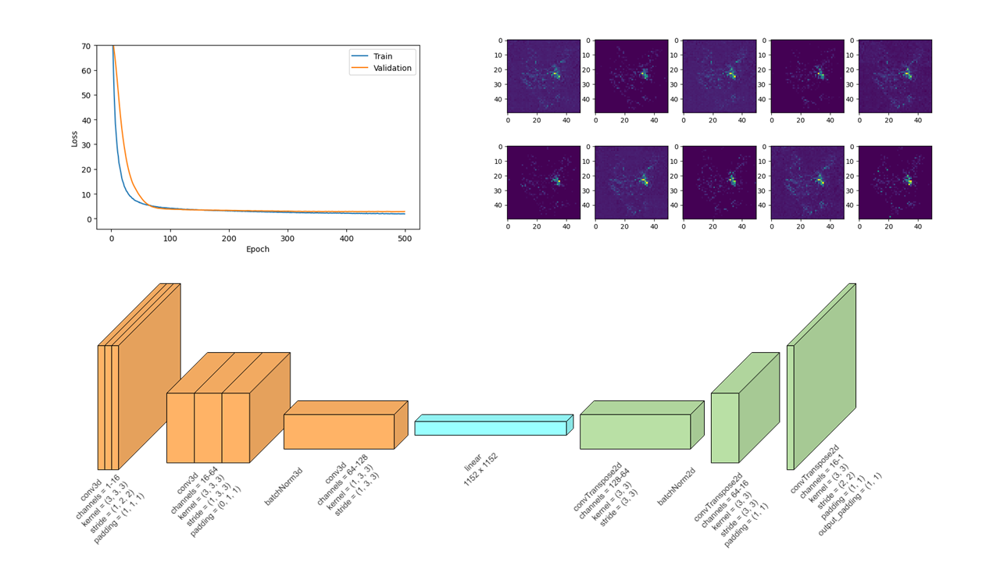
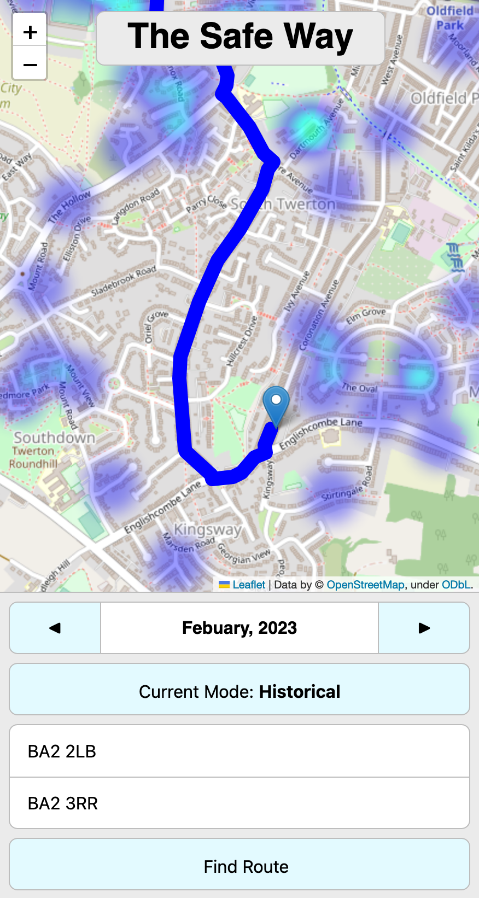

# The Safe Way

Harvey, Jem and Josh's 2023 Bath Hack project, lovingly created in 24 hours ☕️

> It is unacceptable that people in Bath feel threatened and unsafe when walking home late at night. Our application combines cutting-edge ML crime prediction to help users find a safer route home.

### What it does

We have leveraged cutting-edge ML to predict crime patterns within Bath to help users navigate home finding the saftest routes. It is a website that provides the user with a heat map which-represents crime hotspots within the area. The application will also calculate a safe route home the user can go when prompted.

### How we built it

##### Dataset:

- data.police.uk: (provided us with details about all the crimes in Bath and Bristol in addition to their location)

##### ML Model:

The ML model is an encoder-decoder based architecture, built using 3D convolutional layers to capture the last 3 months of crime activity with respect to the location data, which would then predict the density of crime for the next month. We transformed the database of singular crime events from the police API into heatmap images for each month and used these as the training data for our model. We used various regularisation methods to help generalise our model to new data, due to the smaller size of our training data.

### Screenshot

### Installation

1. `git clone` this repo
2. `pip install` 
    - folium
    - numpy
    - pandas
    - matplotlib
    - flask
3. Add a google api key to the file: (JoshRouteFinding/locationAPICall.py)
4. Run `app.py`

you will also need to 

### References

[data.police.uk](https://data.police.uk/)

[wiki.openstreetmap.org](https://wiki.openstreetmap.org/wiki/Routing)

[openrouteservice.org](https://openrouteservice.org/)
